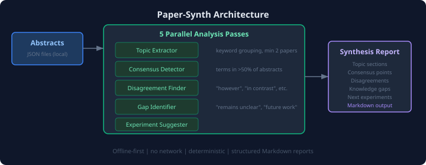

# paper-synth

Offline-first literature synthesis tool — aggregates findings across research abstracts to identify consensus, disagreements, and knowledge gaps.

## Why This Exists

Reading 10 papers takes hours. Comparing their findings takes longer. This tool automates the structural analysis: which terms appear across most papers (consensus), where authors disagree (contrastive language), and what remains unknown (hedging language like "remains unclear" or "future work needed").

It works entirely offline on local JSON abstract files — no network, no API keys, no embeddings. The synthesis is deterministic and reproducible.

## Architecture

<p align="center">
  
</p>

**Five parallel analysis passes:**

1. **Topic Extractor** — Groups abstracts by shared keywords (min 2 papers per topic)
2. **Consensus Detector** — Finds terms appearing in >50% of abstracts
3. **Disagreement Finder** — Flags contrastive markers ("however", "in contrast", "unlike")
4. **Gap Identifier** — Detects hedging language ("remains unclear", "future work", "poorly understood")
5. **Experiment Suggester** — Generates study suggestions from identified gaps

## Install

```bash
pip install -e ".[dev]"
```

## Quickstart

```bash
python -m paper_synth.cli synthesize --input-dir demo_data/abstracts/
```

## Example Output

```
# Literature Synthesis Report

**Abstracts analysed:** 8

## Topic Sections

### Tumor Microenvironment
Topic 'tumor microenvironment' appears in 7 abstracts...

### Immune Response
Topic 'immune response' appears in 6 abstracts...

## Consensus Points
- tumor microenvironment
- immune response
- inflammation
- cytokines

## Disagreements
- "TNF-alpha and NF-kB Crosstalk..." contains contrasting language (however)
- "Checkpoint Inhibitor Resistance..." contains contrasting language (in contrast)

## Knowledge Gaps
- Gap in "Macrophage Polarization...": text mentions "remains unclear"
- Gap in "Regulatory T Cells...": text mentions "poorly understood"

## Suggested Experiments
- Design a controlled study to address: "remains unclear"
- Conduct a systematic review focusing on: "future work"
```

## Demo Data

8 abstracts covering immunology and oncology topics:
- IL-6 signaling, TNF-alpha crosstalk, macrophage polarization
- Checkpoint inhibitor resistance, extracellular vesicles
- Cytokine storms, regulatory T cells, metabolic reprogramming

## Tests

```bash
python -m pytest  # 21 tests
```

## Part of [bio-ai-systems](https://github.com/apeddcrusader/bio-ai-systems)

A collection of tools exploring how AI can assist biological reasoning. See the [full ecosystem](https://github.com/apeddcrusader/bio-ai-systems) for related projects.

## License

MIT
